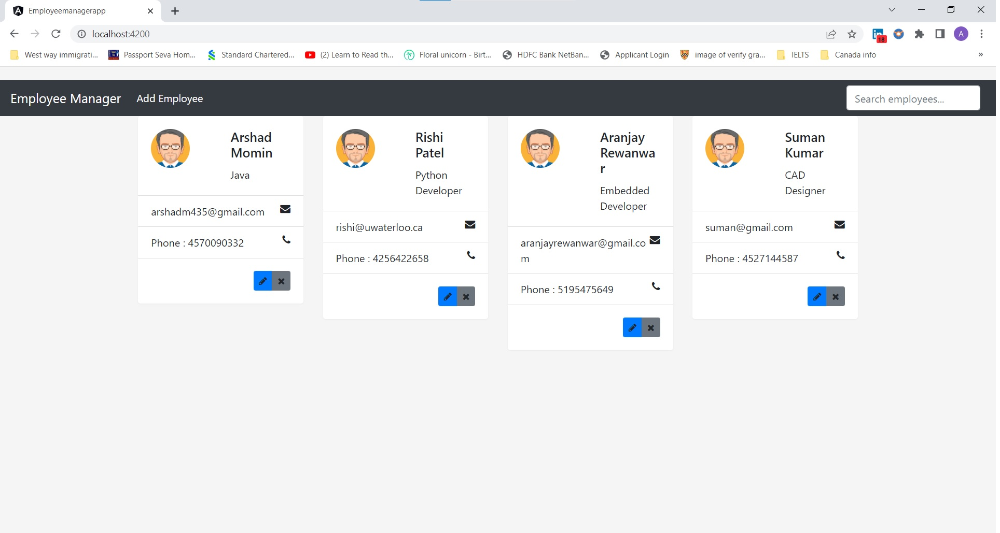

# EmployeeManagementSystem
Created Employee Management System using Angular frontend Framework, Spring boot, Rest APIs to handle CRUD operations on the databases server. Used Apache Tomcat server to host the Backend Service and Implemented the backend using MVC Architecture.

### Backend Implementation & Getting Started

Using the Backend service code, run the Spring boot Application. Initialize the Database by creating and adding the credentials of the server on the application.properties file.

Run the Spring boot application and the Table will be initialized in the selected database by using application properties details.

### Angular Frontend Implementation & Getting Started

Make sure to install Node Js to run the below commands using npm.

Run the below command to initialize the angular cli interface to the project

`npm install -g @angular/cli`

create the project using `ng new project_name`
This above command will install the packages necessary for the project

use `cd project_name` to enter the project directory

use `ng serve` to start the Angular Application

Application images:

## Frontend

